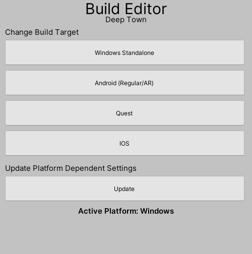

# Build Editor

Easily change build target and all required settings for build, just with a click. Currently, supporting Windows, Regular Android/AR, IOS and Quest build settings. Specially made for oculus/XR settings as it takes time to change all relevant settings.

  

# Getting Started

Download the **latest release** from [Releases](https://github.com/Deep-Town/BuildEditor/releases). Or, if you want to download the project, just clone it.

After importing BuildEditor, import other [Dependencies](https://github.com/Deep-Town/BuildEditor/#dependency-packages).

# Dependency Packages

- XR Interaction Toolkit
- XR Toolkit Manager
- Oculus XR
